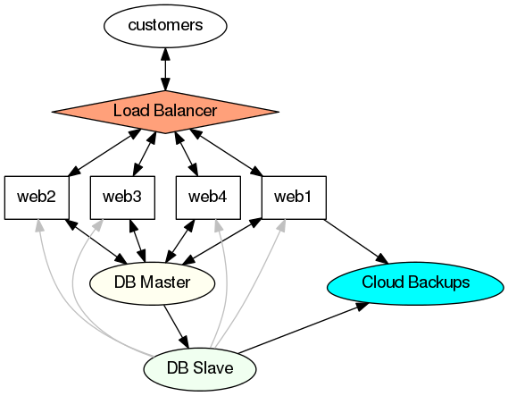

# Autoscale - Introduction

## What is Autoscale ?

The easiest way to explain is with an imaginary case study.

Joe has a website behind a load balancer. It's very popular. With 1 GB of RAM, he can serve about 5 requests at a time, which is fine most days, but when his site gets mentioned on TV, his app has to serve up to 300 requests at once. 

Two of the options that Joe has, to handle the TV spots are:

 * Scale Up:  Build a new server with 20*300=5000 MB of RAM
 * Scale Out: Build 5 x 1GB servers. Autoscale will do the latter for you, automatically.

## Advantages to scaling out rather than up

### The old school mindset - Scaling Up

In the old school mindset, the server is king. You install your site on a server along with Apache, MySQL, PHP and everything you need. If your traffic increases, you grow the server. With older cloud servers, you'd resize it. With dedicated servers, you'd shut it down, swap over the parts, and boot it up again. This requires downtime. There is no scalability designed into the app.

Updates involve the occasional live code update, and live testing. In this mindset, the server is more expensive than the app, so building a new server to test updates is out of the question.

We take nightly incremental backups. Disaster recovery involves building a new server from scratch, trying to remember all our code dependencies, and trial and error for hours or days to re-create a working environment.

This describes the most common implementation of the old mindset.

### The cloud mindset - Scaling Out

In the new mindset, we design our app in a modular fashion to take advantage of what's available in the cloud; the app is king and the cloud serves it. The cloud consists of services; VMs, [cloud databases](http://www.rackspace.com/cloud/databases/), [queues](http://www.rackspace.com/cloud/queues/), [big-data](http://www.rackspace.com/cloud/big-data/), etc.

We use configuration and automation software to develop, deploy and scale the app. eg. [Puppet](http://puppetlabs.com/puppet/puppet-open-source), [chef](http://www.getchef.com/chef/), [salt stack](http://www.saltstack.com/), [Ansible](http://www.ansible.com/home), and/or [docker.io](http://docker.io/), etc. You use [cloud APIs](http://docs.rackspace.com/) to build the necessary components.

The live data is continually backed up. The deployment script is stored in a code repository like git. With continual backups of the data and the deployment code, you can rebuild your entire environment in a matter of seconds or minutes for disaster recovery, testing, or upgrading.

Serving the app is a wholistic operation; taking into account development, testing, uptime, scaling, updates, and disaster recovery. We automate as much of it as we can.

# Series Overview

The [autoscale API](http://docs.rackspace.com/cas/api/v1.0/autoscale-devguide/content/Overview.html) is one tool in the belt of the cloud architect. Basically it allows us to replicate VMs in response to certain situations where more or less VMs are needed. In the normal use case, we'd make a VM image that provides a service to our app, and when it boots up it joins starts serving the app ASAP.

[This earlier document](http://www.rackspace.com/blog/start-using-auto-scale-today/) gives a good overview of using the [graphical user interface](https://mycloud.rackspace.com/) to schedule autoscale operations by time. In this series of documents, we'll cover using the API to trigger AutoScale operations based on other events, and touch on some practicle examples with the imaginary use case of Jo's site.

# Jo's setup

This is the architecture we'll be using in our examples.

In this use case, Jo use [Gluster FS](TODO: LINK GLUSTER ARTICLE) to share the PHP code, and sessions between all the Web Servers. We use [Rackspace Networks](http://www.rackspace.com/cloud/networks/), one network for all hosts plus the DB.

The resource we'll be autoscaling will be the Web servers. 

# Glossary

Lets just cover some of the terms that we'll be using before moving onwards:

 * Cloud Server - In our case a running web server
 * Cloud Server Image - This is the image that we use to boot up each new web server
 * Monitoring - Rackspace monitoring API .. we'll create a custom monitor to trigger auto scale events based on server load.
 * Load Balancer - This receives incoming requests and balances out the load between all the existing web heads.
 * Scaling Group - This is the main unit of the AutoScale system. A scaling group manages the number of servers behind one or more load balancers.

# Summary

Now we understand a little about the why and what, in the next articles we'll go through the auto scaling part of Jo's setup.
